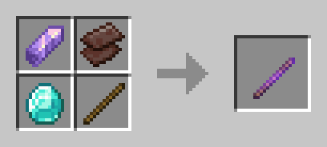

# 🪄 Just Another Survival Debug Stick

**A lightweight server-side Fabric mod that enables survival players to craft and use the Debug Stick — without any restrictions,
literally.**

---

## 📖 Overview

The **Just Another Survival Debug Stick** mod allows players in survival mode to craft and use the Debug Stick just like in Creative
mode.  
It brings back the full power of block state editing — now accessible without cheats or operator permissions.

This project is heavily inspired by [Just_S’s Survival Debug Stick (SDS)](https://modrinth.com/mod/survival-debug-stick)
mod but rewritten from scratch to be **simplier** (and probably more lightweight), and **up-to-date** (because Just_S's mod hasn't been updated for a while) with modern Minecraft versions.

---

## 🔍  Showcase
It works with every block and property (at least for now), so be prepared for potential chaos on your server if you don’t fully trust your players.

---

## 🛠 Crafting Recipe

Mod uses shapeless recipe provided below.



You can easily edit craft by changing it in mod's compiled json or change it in source and compile it
```json
{
    "type": "minecraft:crafting_shapeless",
    "ingredients": [
        "minecraft:amethyst_shard",
        "minecraft:netherite_scrap",
        "minecraft:diamond",
        "minecraft:stick"
    ],
    "result": {
        "id": "minecraft:debug_stick",
        "count": 1
    },
    "group": "stuff"
}
```

---
## ✅ Plans
- [x] Add whitelist & backlist customization (for properties & blocks)
- [ ] Backport to older Minecraft version (1.21.4 - 1.21.8)